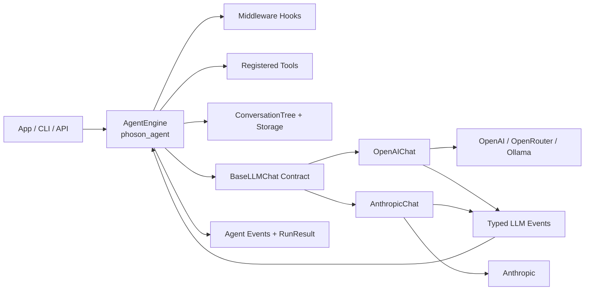
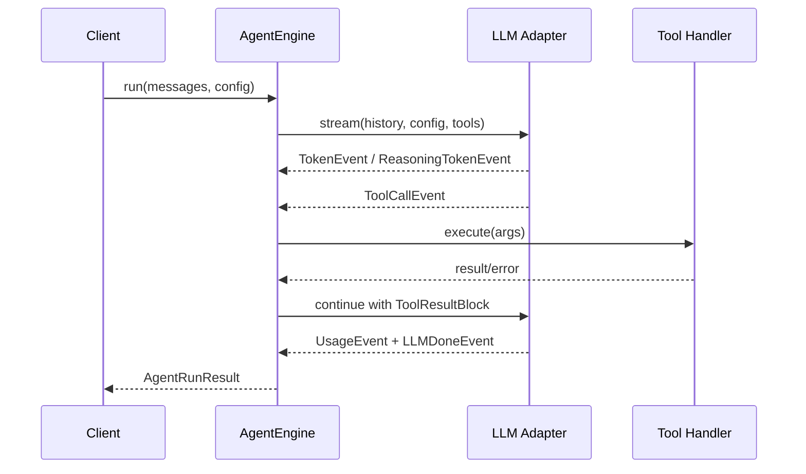

<p align="center">
  
</p>

# phoson-engine-minimal

Minimal Python runtime for the Phoson agent engine.


> Internal repository for `phoson.lat` developers only.

## What this project is

`phoson-engine-minimal` is the core runtime behind the Phoson autonomous-agent platform.
It is intentionally built without agent frameworks (no LangChain/LangGraph), using provider SDKs directly plus a custom ReAct loop to keep control over:

- Streaming behavior and normalized events
- Tool-call orchestration
- Cost and credit accounting
- Observability (`RunStep`, typed events)
- Session tree persistence

## High-level architecture



## Runtime loop (tool call cycle)



## Repository map

```text
phoson-engine-minimal/
├── phoson_llm/        # LLM normalization layer (adapters + schemas + pricing)
├── phoson_agent/      # ReAct agent loop, tools, middleware, sessions
├── tests/             # Unit/integration tests for llm and agent layers
├── .github/workflows/ # CI and security automation
├── PROJECT.md         # Deep architecture notes and roadmap (Spanish)
└── pyproject.toml     # Project metadata, dependencies, tooling config
```

## Core modules

- `phoson_llm`: provider adapters return a single typed event stream (`LLMEvent` subclasses).
- `phoson_agent`: stateless-by-run orchestration over message history with tool execution.
- `phoson_agent.sessions`: branchable conversation tree + JSONL-backed storage.
- `phoson_llm.pricing`: model pricing table + `calculate_cost()` for provider-level USD usage.

## Development setup

Install dependencies:

```bash
uv sync --dev --locked
```

Install git hooks:

```bash
uv run pre-commit install --install-hooks
uv run pre-commit install --hook-type commit-msg
uv run pre-commit install --hook-type pre-push
```

## Run checks locally

```bash
uv run ruff format --check .
uv run ruff check .
uv run python -m compileall phoson_llm phoson_agent
uv run pytest -q
```

## Environment variables

```env
ANTHROPIC_API_KEY=
OPENAI_API_KEY=
OPENROUTER_API_KEY=
```

Use `OPENROUTER_API_KEY` when initializing `OpenAIChat` with an OpenRouter `base_url`.

## Minimal usage example

```python
from phoson_agent import AgentEngine
from phoson_llm.chats.openai import OpenAIChat
from phoson_llm.schemas import Message, ModelConfig

engine = AgentEngine(
    chat=OpenAIChat(),
    tools=[],
    phoson_weight=1.2,
)

result = engine.run_sync(
    messages=[Message(role="user", content="Summarize this project in one line")],
    config=ModelConfig(model="openai/gpt-4o-mini", max_tokens=128),
)

print(result.final_content)
print(result.total_cost_usd, result.total_credits)
```

## CI and security workflows

- `.github/workflows/ci.yml`: format check, lint, smoke compile, and tests on PRs and pushes to `main`.
- `.github/workflows/security.yml`: dependency audit and secret scan on PRs, pushes to `main`, and weekly schedule.

## Commit message format

Conventional Commits are enforced through a `commit-msg` hook.

Examples:

- `feat: add streaming chat abstraction`
- `fix: handle unknown model pricing fallback`
- `chore: update pre-commit hook versions`

Common types: `feat`, `fix`, `docs`, `refactor`, `test`, `chore`, `ci`.
