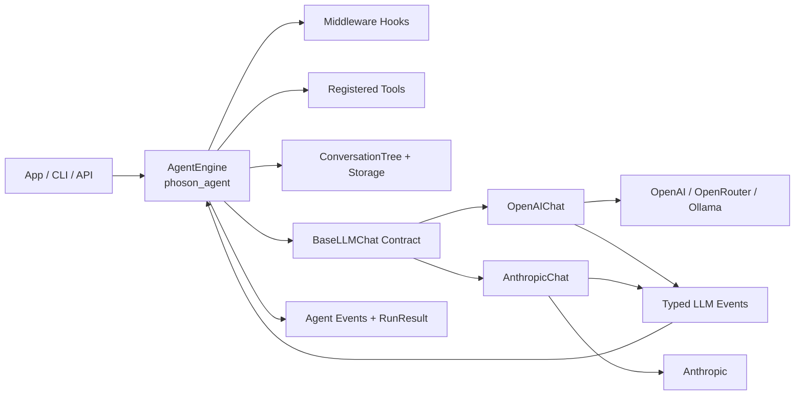
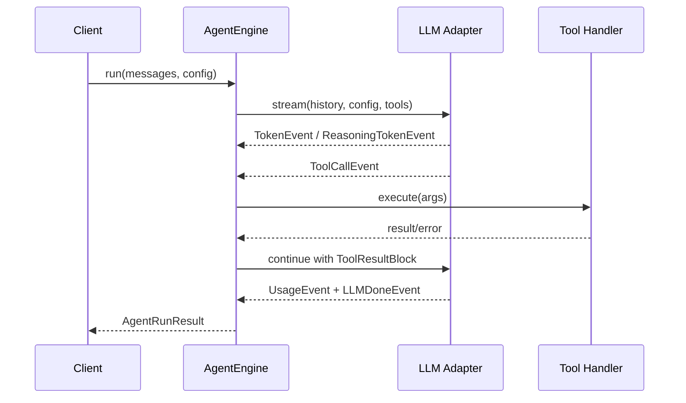
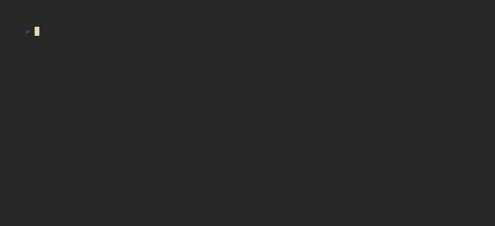

<p align="center">
  
</p>

<h1 align="center">phoson-engine-minimal</h1>

<p align="center">
  <strong>Minimal Python runtime for the Phoson autonomous-agent platform</strong>
</p>

<p align="center">
  
</p>

<p align="center">
  <a href="#-quick-start"></a>
  <a href="https://pypi.org/project/phoson-engine-minimal/"></a>
  <a href="#-installation"></a>
  <a href="#-development-setup"></a>
  <a href="#-run-checks-locally"></a>
  <a href="https://github.com/phoson-lat/phoson-engine-minimal/blob/main/LICENSE"></a>
  <a href="https://github.com/phoson-lat/phoson-engine-minimal/stargazers"></a>
  <a href="https://github.com/phoson-lat/phoson-engine-minimal/actions"></a>
</p>

> 🔥 **Open Source** — Built for developers who want full control over their AI agents.

---

## 📋 Table of Contents

- [What this project is](#-what-this-project-is)
- [Why Phoson?](#-why-phoson)
- [Features](#-features)
- [High-level architecture](#-high-level-architecture)
- [Repository map](#-repository-map)
- [Core modules](#-core-modules)
  - [`phoson_llm` — LLM normalization layer](#phoson_llm--llm-normalization-layer)
  - [`phoson_agent` — Agent orchestration](#phoson_agent--agent-orchestration)
  - [`phoson_agent.sessions` — Conversation persistence](#phoson_agentsessions--conversation-persistence)
  - [`phoson_cli` — Interactive REPL](#phoson_cli--interactive-repl)
- [🚀 Quick Start](#-quick-start)
- [Installation](#-installation)
  - [Standalone binaries (no Python required)](#standalone-binaries-no-python-required)
- [Development setup](#-development-setup)
- [Run checks locally](#-run-checks-locally)
- [Environment variables](#-environment-variables)
- [Usage examples](#-usage-examples)
  - [Minimal agent usage](#minimal-agent-usage)
  - [Define a tool](#define-a-tool)
  - [Interactive CLI](#interactive-cli)
- [CI and security workflows](#-ci-and-security-workflows)
- [Commit message format](#-commit-message-format)
- [Roadmap](#-roadmap)
- [Contributing](#-contributing)
- [License](#-license)
- [Support](#-support)

---

## 🤔 What this project is

`phoson-engine-minimal` is the **core runtime** behind the Phoson autonomous-agent platform. It's a lightweight, framework-free Python implementation that gives you **complete control** over your AI agents without the bloat of heavy frameworks.

Unlike other agent frameworks (LangChain, LangGraph, etc.), Phoson is built **from scratch** using provider SDKs directly, with a custom ReAct loop designed for:

- 🔄 **Streaming behavior** — Token-by-token events for real-time UIs
- 🔧 **Tool-call orchestration** — Full control over tool execution
- 💰 **Cost accounting** — Track spend per run with built-in pricing
- 👁️ **Observability** — `RunStep` events and typed event streams
- 🌳 **Session trees** — Branchable conversation history (not linear!)
- ⌨️ **Interactive REPL** — Debug and iterate on agents interactively

---

## 🎯 Why Phoson?

| Traditional Frameworks | Phoson |
|------------------------|--------|
| Heavy dependencies | Zero external agent frameworks |
| Linear conversations | Branchable conversation trees |
| Black-box streaming | Full event visibility |
| Fixed patterns | Custom ReAct loop |
| Enterprise pricing | MIT licensed |

---

## ✨ Features

| Feature | Description |
|---------|-------------|
| **Framework-free** | Pure Python + provider SDKs; no LangChain/LangGraph |
| **Multi-provider** | 20+ providers behind a single `BaseLLMChat` contract |
| **Typed events** | Normalized `LLMEvent` stream for all providers |
| **Tool execution** | `@tool` decorator with JSON Schema definitions |
| **Middleware hooks** | Pre/post processing for LLM calls and tool execution |
| **Branching sessions** | `ConversationTree` for non-linear conversation history |
| **Interactive CLI** | Full-screen TUI (default) + classic REPL: streaming, rewind, sessions, pickers |
| **Sub-agents** | Parallel `agent`/`agents` tools with isolated context and per-agent models |
| **Skills** | On-demand instruction packages indexed at one line; loaded via tool call |
| **MCP** | Model Context Protocol servers as first-class tools (`/mcp`) |
| **Plugins** | Official & community plugins: tools, slash commands, CLI look |
| **Monitors** | Long-running watchers (interval/file/command) that re-activate the agent on wake |
| **Permissions** | Per-tool `allow`/`ask`/`deny` + allow-patterns, editable at runtime |
| **Auto-compaction** | Structured handoff summaries keep long sessions inside the context window |
| **Cost tracking** | Built-in pricing module for USD usage calculation |
| **Prompt caching** | Cache-aware Anthropic & OpenRouter requests; cached-token metrics |
| **Thinking support** | Native reasoning/thinking token handling (Anthropic & OpenAI o1) |
| **Standalone binaries** | Prebuilt single-file releases for Linux, macOS and Windows (no Python) |

---

## 🏗️ High-level architecture



### Runtime loop (tool call cycle)



---

## 🗺️ Repository map

```
phoson-engine-minimal/
├── phoson_llm/           # LLM normalization layer (adapters + schemas + pricing)
├── phoson_agent/         # ReAct agent loop, tools, middleware, sessions
├── phoson_cli/           # Interactive CLI (TUI + classic REPL) for agent sessions
├── phoson_plugin_*/      # Official plugins (checkpoint, mcp, memory, monitor)
├── examples/             # Runnable engine/plugin/MCP usage examples
├── bench/                # Benchmarks (run_bench.py + tasks)
├── scripts/              # Installers, uninstall and dev/bench scripts
├── assets/               # README visuals (screenshots, demo GIFs, VHS tapes)
├── tests/                # Unit/integration tests for all layers
├── docs/api/             # Per-package API documentation
├── docs/cli/             # Deep-dive CLI documentation (keybindings, caching, …)
├── .github/workflows/    # CI, release, binaries and security automation
├── ROADMAP.md            # Project roadmap
└── pyproject.toml        # Project metadata, dependencies, tooling config
```

---

## 📦 Core modules

### `phoson_llm` — LLM normalization layer

Provider adapters return a single typed event stream (`LLMEvent` subclasses):

| Event | Description |
|-------|-------------|
| `LLMStartEvent` | Call start (model, message count) |
| `TokenEvent` | Text fragment token-by-token |
| `ReasoningStartEvent` | Model started reasoning (Anthropic thinking / OpenAI o1) |
| `ReasoningTokenEvent` | Reasoning fragment |
| `ReasoningDoneEvent` | Complete reasoning block |
| `ToolCallDeltaEvent` | Partial tool args chunk (for real-time UI) |
| `ToolCallEvent` | Complete tool call with parsed args |
| `UsageEvent` | Tokens + cost in USD |
| `LLMDoneEvent` | Full assembled text (always last) |
| `ErrorEvent` | Error with code, message, retryable flag |

**Supported providers:**

| Category | Providers |
|----------|-----------|
| Native adapters | **OpenAI** (tool use, reasoning effort), **Anthropic** (thinking, tool use, prompt caching), **Google Gemini**, **Mistral**, **Azure OpenAI**, **AWS Bedrock** |
| OpenAI-compatible endpoints | **OpenRouter**, **Ollama**, **LM Studio**, **vLLM**, **DeepSeek**, **Groq**, **xAI (Grok)**, **Together**, **Perplexity**, **NVIDIA**, **Fireworks**, **Cohere**, **GitHub Models** |

All of them are available via the `build_chat()` factory, e.g. `build_chat("openrouter")`, and expose the same `stream()` event contract.

Pricing module (`phoson_llm.pricing`) provides `calculate_cost()` for provider-level USD usage.

### `phoson_agent` — Agent orchestration

Stateless-by-run orchestration over message history with tool execution:

- `AgentEngine` — Main entry point for running agents (async and sync)
- `@tool` decorator — Transform Python functions into `AgentTool` definitions with JSON Schema
- `AgentMiddleware` — Hooks for pre/post processing (LLM calls, tool execution)
- `AgentContext` — Shared state across middleware and tools

### `phoson_agent.sessions` — Conversation persistence

- `ConversationTree` — Branchable conversation structure (not linear)
- `ConversationNode` — Individual node with messages, children, label
- `JsonlStorage` — JSONL-backed session storage (local file)
- `SessionMeta` — Session metadata (id, message_count, created_at, updated_at)

### `phoson_cli` — Interactive REPL

Command-line interface for interactive agent sessions:

- `PhosonApp` — Full-screen TUI (default) with scrollable chat pane, pickers and overlays
- `PhosonRepl` — Classic line-by-line REPL (`--classic`), retained for debugging
- ~30 slash commands (sessions, model/provider, compaction, MCP, permissions, metrics…) — see [Interactive CLI](#interactive-cli)
- Real-time streaming responses, one-shot mode for scripts/CI
- Session persistence, branching, and rewind

---

## 🚀 Quick Start

```python
from phoson_agent import AgentEngine
from phoson_llm import build_chat
from phoson_llm.schemas import Message, ModelConfig

engine = AgentEngine(chat=build_chat("openai"))

result = engine.run_sync(
    messages=[Message(role="user", content="Summarize this project in one line")],
    config=ModelConfig(model="openai/gpt-4o-mini", max_tokens=128),
)

print(result.final_content)
print(result.total_cost_usd, result.total_credits)
```

Or run the interactive CLI:

```bash
uv run phoson-cli
```

Run the setup wizard to configure provider credentials and defaults:

```bash
uv run phoson-cli --setup
```

---

## 📥 Installation

```bash
# Clone the repository
git clone https://github.com/phoson-lat/phoson-engine-minimal.git
cd phoson-engine-minimal

# Install dependencies
uv sync --dev --locked

# Install git hooks
uv run pre-commit install --install-hooks
uv run pre-commit install --hook-type commit-msg
uv run pre-commit install --hook-type pre-push
```

### Standalone binaries (no Python required)

Prebuilt `phoson-cli` binaries are attached to each
[GitHub release](https://github.com/phoson-lat/phoson-engine-minimal/releases)
— no Python interpreter or `uv`/`pip` needed (issue #93):

| Platform | Asset |
|----------|-------|
| Linux x86_64 | `phoson-cli-linux-x86_64` |
| Linux ARM64 | `phoson-cli-linux-arm64` |
| macOS Apple Silicon | `phoson-cli-darwin-arm64` |
| macOS Intel | `phoson-cli-darwin-x86_64` |
| Windows x86_64 | `phoson-cli-windows-x86_64.exe` |

Download the asset for your platform, make it executable (Unix), and run:

```bash
chmod +x phoson-cli
./phoson-cli --setup     # configure credentials, then just: phoson-cli
```

`--self-update` inside a binary points back to the Releases page
(the binary is a one-file bundle with no package metadata to upgrade).


---

## 🛠️ Development setup

### Install dependencies

```bash
uv sync --dev --locked
```

### Install git hooks

```bash
uv run pre-commit install --install-hooks
uv run pre-commit install --hook-type commit-msg
uv run pre-commit install --hook-type pre-push
```

---

## ✅ Run checks locally

```bash
uv sync --dev --all-extras   # --all-extras is needed for pyright (provider SDK stubs)
uv run ruff format --check .
uv run ruff check .
uv run pyright
uv run python -m compileall phoson_llm phoson_agent phoson_cli
uv run pytest -q
```

---

## 🔐 Environment variables

Set the variables for the providers you use (the adapter reads the default when no `api_key` is passed):

```env
# Cloud providers
OPENAI_API_KEY=
ANTHROPIC_API_KEY=
OPENROUTER_API_KEY=
GEMINI_API_KEY=
MISTRAL_API_KEY=
GROQ_API_KEY=
XAI_API_KEY=
DEEPSEEK_API_KEY=
TOGETHER_API_KEY=
PERPLEXITY_API_KEY=
NVIDIA_API_KEY=
FIREWORKS_API_KEY=
COHERE_API_KEY=
GITHUB_TOKEN=

# Azure OpenAI
AZURE_OPENAI_ENDPOINT=
AZURE_OPENAI_API_KEY=
AZURE_OPENAI_DEPLOYMENT=

# AWS Bedrock (plus standard AWS credentials: AWS_ACCESS_KEY_ID / AWS_SECRET_ACCESS_KEY)
AWS_DEFAULT_REGION=us-east-1
```

Local servers (Ollama, LM Studio, vLLM) need no API key — just the right `base_url`.

---

## 💻 Usage examples

### Minimal agent usage

```python
from phoson_agent import AgentEngine
from phoson_llm import build_chat
from phoson_llm.schemas import Message, ModelConfig

engine = AgentEngine(chat=build_chat("openai"))

result = engine.run_sync(
    messages=[Message(role="user", content="Summarize this project in one line")],
    config=ModelConfig(model="openai/gpt-4o-mini", max_tokens=128),
)

print(result.final_content)
print(result.total_cost_usd, result.total_credits)
```

### Define a tool

```python
import ast
import operator

from phoson_agent import tool


@tool
def calculate(expression: str) -> str:
    """Safely evaluate a basic arithmetic expression like "2 + 2 * 10"."""

    def _eval(node: ast.AST):
        match node:
            case ast.Expression(body=value):
                return _eval(value)
            case ast.Constant():
                return node.value
            case ast.BinOp(left=left, op=op, right=right):
                ops = {
                    ast.Add: operator.add,
                    ast.Sub: operator.sub,
                    ast.Mult: operator.mul,
                    ast.Div: operator.truediv,
                }
                if type(op) not in ops:
                    raise ValueError(f"Unsupported operator: {type(op).__name__}")
                return ops[type(op)](_eval(left), _eval(right))
            case ast.UnaryOp(op=op, operand=value) if isinstance(op, ast.USub):
                return -_eval(value)
        raise ValueError(f"Unsupported expression: {expression!r}")

    return str(_eval(ast.parse(expression, mode="eval")))
```

> ⚠️ **Never use `eval()`/`exec()` on model-generated input** — treat LLM output as untrusted and validate or sandbox every tool argument.

### Interactive CLI

```bash
uv run phoson-cli          # full-screen TUI (default)
uv run phoson-cli --setup  # first-run wizard: credentials + defaults
```

<details>
<summary><strong>▶ Phoson in action</strong> (one-shot: prompt → tool call → answer)</summary>

<p align="center"></p>

</details>

**One-shot mode** (no REPL, no session — for scripts and CI): the final
answer goes to stdout, exit code 0 on success / 1 on agent error.

```bash
phoson-cli "fix the failing tests"     # positional task
phoson-cli -p "summarize this repo"    # --print flag
echo "explain the CI failure" | phoson-cli   # piped stdin
```

**Command-line flags** (one-off overrides; they never touch
`~/.phoson/config.toml`):

| Flag | Effect |
|------|--------|
| `--model <id>` / `--provider <id>` | Override model / provider for this run |
| `--theme <tier>` | Override theme: `dark`, `light`, `ansi`, `no-color` |
| `--max-turns <n>` | Override max iterations for this run |
| `-p, --print` | Print the final answer and exit (one-shot mode) |
| `--classic` / `--no-fullscreen` | Use the classic line-by-line REPL |
| `--setup` / `--install` | Run the setup wizard |
| `--self-update` | Check for and install CLI updates (same flow as `/update`) |
| `--uninstall` | Uninstall phoson-cli |
| `--install-plugin <source>` | Install and enable a community plugin (alias for `plugin install`; `-y/--yes` skips the confirmation) |
| `plugin <command>` | Manage plugins: `install`, `list`, `enable`, `disable`, `remove`, `update`, `doctor` |
| `--version` / `-h, --help` | Print the version / usage and exit |

The full-screen TUI is the default interactive front end; `--classic`
launches the classic REPL (Rich scrollback) — useful for debugging and on
terminals without full-screen support. When `TERM` is unset or `dumb`,
the classic REPL is selected automatically.

**Slash commands** (type `/help` inside the REPL for the live list):

| Command | What it does |
|---------|--------------|
| `/new` (`/clear`) | Start a new session |
| `/model`, `/provider`, `/subagent-model` | Unified pickers (or set directly) for the active model, provider, and sub-agent model |
| `/reasoning-effort` (`/effort`) | Show or set reasoning effort: `low`…`max`, `off` |
| `/sessions` | List saved sessions; load one by `#` or via picker |
| `/resume <id>` | Resume a saved session (prefix match works) |
| `/delete <id>` | Delete a session by id |
| `/tree` | Show the conversation tree as ASCII |
| `/label <text>` / `/title` | Label the current node / set a session title |
| `/undo` | Undo the last turn (branch from before your last message) |
| `/compact` | Preview + confirm compaction; `/compact on\|off` toggles auto-compaction |
| `/attach` (`/attachments`) | Attach a file to the next message, or list pending attachments |
| `/permissions` (`/perms`) | Show or change per-tool `allow`/`ask`/`deny` levels |
| `/mcp` | Manage Model Context Protocol servers |
| `/status`, `/env`, `/cost`, `/tokens`, `/steps` | Session metrics: provider/model/permissions, environment, running cost, token totals, step count |
| `/theme` | Pick or set the color theme (live preview; `list` to list) |
| `/keys` | List the key bindings and the `[keys]` remap syntax |
| `/agents-md` | Show which AGENTS.md/CLAUDE.md memory files are loaded |
| `/skills` | List available skills; `/skills <name>` shows one's instructions |
| `/setup` | Run the initial setup wizard again |
| `/update` (`/upgrade`) | Check for and install CLI updates |
| `/help` | Show all commands |
| `/exit` (`/quit`) | Exit the REPL |

Plugins can register additional slash commands (see
[docs/plugins.md](docs/plugins.md)).

**Behavior highlights** — one-line summaries; deep dives in
[docs/cli/](docs/cli/index.md):

- **Rewind** — double-`Esc` while idle jumps the conversation back to an
  earlier message; `Ctrl+Z` undoes the jump → [docs/cli/rewind.md](docs/cli/rewind.md)
- **Key bindings** — remappable via `[keys]` in `~/.phoson/config.toml`
  (validated at startup); `Ctrl+T` toggles the live reasoning view →
  [docs/cli/keybindings.md](docs/cli/keybindings.md)
- **Text selection & links** — `Shift+Drag` selects chat text natively;
  markdown links render as clickable OSC 8 hyperlinks →
  [docs/cli/mouse-and-links.md](docs/cli/mouse-and-links.md)
- **`@file` mentions** — type `@` and the composer fuzzy-filters repo
  paths; on send, files are inlined (text) or become native media blocks
  (images/audio/video/pdf), same as `/attach`.
- **Prompt caching** — cacheable prefix by default (Anthropic
  `cache_control` + OpenRouter sticky routing); cached tokens surface in
  `/status` and `/tokens`, typically cutting long-session prompt cost
  50–90% → [docs/cli/prompt-caching.md](docs/cli/prompt-caching.md)
- **Permissions** — per-tool `allow`/`ask`/`deny` + allow-patterns in
  `~/.phoson/permissions.json`; non-interactive runs fail closed →
  [docs/cli/permissions.md](docs/cli/permissions.md)
- **Project memory** — `AGENTS.md` (or `CLAUDE.md`) from the repo root to
  your CWD is injected into the system prompt; `/agents-md` lists what
  loaded → [docs/cli/agents-md.md](docs/cli/agents-md.md)
- **Skills** — `SKILL.md` packages indexed at one line; the agent loads
  the full body on demand without busting the prompt cache →
  [docs/cli/skills.md](docs/cli/skills.md)
- **Models config** — `~/.phoson/models.json` for model overrides and
  non-sensitive provider settings; light/dark theme auto-detection →
  [docs/cli/models-config.md](docs/cli/models-config.md)
- **Auto-compaction** — structured handoff summaries keep long sessions
  inside the context window; `/compact` previews before applying →
  [docs/cli/compaction.md](docs/cli/compaction.md)
- **UI** — scrollable chat pane, multiline composer, overlay pickers,
  animated activity line (`Thinking… → Composing tool… →
  Running tool…`) → [docs/cli/ui.md](docs/cli/ui.md)

**Self-update:** at launch the CLI checks PyPI in the background (at most
once every 24 h). When a newer release exists it shows a dim one-line
hint — `⬆ v0.x.y available — /update` — in the TUI header (full-screen)
or the prompt line (classic). It never blocks first paint, input, or a
run; one-shot mode is untouched. `/update` or `--self-update` install
it.

---

## 🔒 CI and security workflows

- `.github/workflows/ci.yml`: Format check, lint, smoke compile, and tests on PRs and pushes to `main`.
- `.github/workflows/publish.yml`: Build sdist/wheel and publish to PyPI on release.
- `.github/workflows/release-binaries.yml`: Build standalone `phoson-cli` binaries (Linux/macOS/Windows) attached to each GitHub release.
- `.github/workflows/security.yml`: Dependency audit and secret scan on PRs, pushes to `main`, and weekly schedule.

---

## 📝 Commit message format

Conventional Commits are enforced through a `commit-msg` hook.

**Examples:**

```
feat: add streaming chat abstraction
fix: handle unknown model pricing fallback
chore: update pre-commit hook versions
```

**Common types:** `feat`, `fix`, `docs`, `refactor`, `test`, `chore`, `ci`

---

## 🗓️ Roadmap

For the project roadmap see [ROADMAP.md](./ROADMAP.md), and per-package API documentation under [docs/api/](./docs/api/index.md).

---

## 🤝 Contributing

Contributions are welcome! Here's how you can help:

1. **Fork** the repository
2. Create a feature branch: `git checkout -b feature/amazing-feature`
3. Commit your changes: `git commit -m 'feat: add amazing feature'`
4. Push to the branch: `git push origin feature/amazing-feature`
5. Open a **Pull Request**

> 🌐 **Language policy:** everything in this repository must be in **English** — documentation, docstrings, code comments, commit messages, issue titles and bodies, and PR descriptions. This keeps the project accessible to contributors worldwide. If you're more comfortable writing in another language, draft your changes in a branch and maintainers will help polish the English before merge.

Please read [CONTRIBUTING.md](./CONTRIBUTING.md) for details on our code of conduct and development process.

### Ideas for contributions

- 🆕 Add new LLM providers (20+ already supported — see the table above)
- 🔧 Improve tool execution (batching, retries, caching)
- 📊 Add observability integrations (OpenTelemetry, Langfuse)
- 🖥️ Build a web-based REPL or playground
- 📚 Improve documentation and examples

---

## 📄 License

This project is licensed under the **MIT License** — see the [LICENSE](./LICENSE) file for details.

```
MIT License

Copyright (c) 2024 Phoson

Permission is hereby granted, free of charge, to any person obtaining a copy
of this software and associated documentation files (the "Software"), to deal
in the Software without restriction, including without limitation the rights
to use, copy, modify, merge, publish, distribute, sublicense, and/or sell
copies of the Software, and to permit persons to whom the Software is
furnished to do so, subject to the following conditions:

The above copyright notice and this permission notice shall be included in all
copies or substantial portions of the Software.

THE SOFTWARE IS PROVIDED "AS IS", WITHOUT WARRANTY OF ANY KIND, EXPRESS OR
IMPLIED, INCLUDING BUT NOT LIMITED TO THE WARRANTIES OF MERCHANTABILITY,
FITNESS FOR A PARTICULAR PURPOSE AND NONINFRINGEMENT. IN NO EVENT SHALL THE
AUTHORS OR COPYRIGHT HOLDERS BE LIABLE FOR ANY CLAIM, DAMAGES OR OTHER
LIABILITY, WHETHER IN AN ACTION OF CONTRACT, TORT OR OTHERWISE, ARISING FROM,
OUT OF OR IN CONNECTION WITH THE SOFTWARE OR THE USE OR OTHER DEALINGS IN THE
SOFTWARE.
```

---

## 💬 Support

- **Issues:** [GitHub Issues](https://github.com/phoson-lat/phoson-engine-minimal/issues) for bug reports
- **Discussions:** [GitHub Discussions](https://github.com/phoson-lat/phoson-engine-minimal/discussions) for questions
- **Documentation:** See [docs/api/](./docs/api/index.md) for per-package API notes
- **Website:** [https://phoson.lat](https://phoson.lat)
- **SDK Docs:** [https://phoson.lat/docs](https://phoson.lat/docs)

---

## ⭐ Show your support

Give us a ⭐️ if this project helped you build better AI agents!

---

<p align="center">
  Built with 🔥 by <a href="https://phoson.lat">phoson.lat</a>
</p>