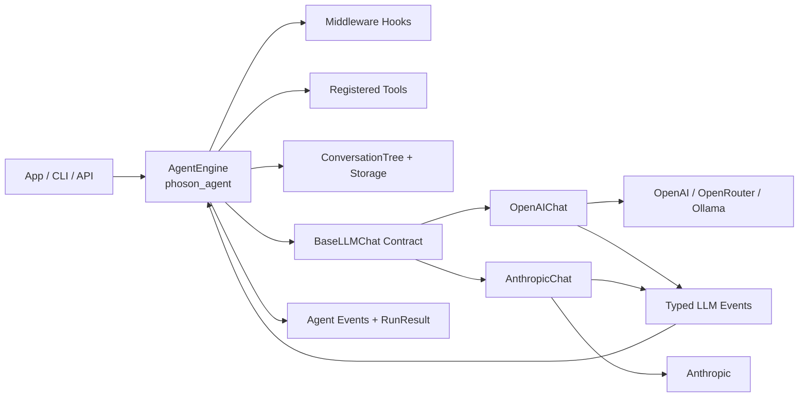
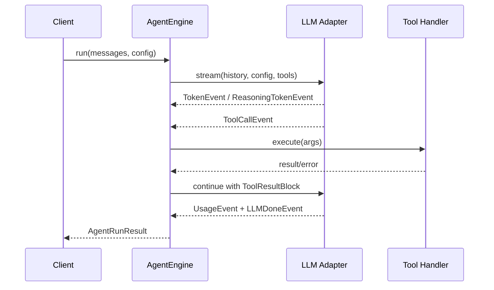

<p align="center">
  
</p>

<h1 align="center">phoson-engine-minimal</h1>

<p align="center">
  <strong>Minimal Python runtime for the Phoson autonomous-agent platform</strong>
</p>

<p align="center">
  <a href="#-quick-start"></a>
  <a href="#-installation"></a>
  <a href="#-development-setup"></a>
  <a href="#-run-checks-locally"></a>
  <a href="https://github.com/phoson-lat/phoson-engine-minimal/blob/main/LICENSE"></a>
  <a href="https://github.com/phoson-lat/phoson-engine-minimal/stargazers"></a>
  <a href="https://github.com/phoson-lat/phoson-engine-minimal/actions"></a>
</p>

> 🔥 **Open Source** — Built for developers who want full control over their AI agents.

---

## 📋 Table of Contents

- [What this project is](#-what-this-project-is)
- [Why Phoson?](#-why-phoson)
- [Features](#-features)
- [High-level architecture](#-high-level-architecture)
- [Repository map](#-repository-map)
- [Core modules](#-core-modules)
  - [`phoson_llm` — LLM normalization layer](#phoson_llm--llm-normalization-layer)
  - [`phoson_agent` — Agent orchestration](#phoson_agent--agent-orchestration)
  - [`phoson_agent.sessions` — Conversation persistence](#phoson_agentsessions--conversation-persistence)
  - [`phoson_cli` — Interactive REPL](#phoson_cli--interactive-repl)
- [🚀 Quick Start](#-quick-start)
- [Installation](#-installation)
- [Development setup](#-development-setup)
- [Run checks locally](#-run-checks-locally)
- [Environment variables](#-environment-variables)
- [Usage examples](#-usage-examples)
  - [Minimal agent usage](#minimal-agent-usage)
  - [Define a tool](#define-a-tool)
  - [Interactive CLI](#interactive-cli)
- [CI and security workflows](#-ci-and-security-workflows)
- [Commit message format](#-commit-message-format)
- [Roadmap](#-roadmap)
- [Contributing](#-contributing)
- [License](#-license)
- [Support](#-support)

---

## 🤔 What this project is

`phoson-engine-minimal` is the **core runtime** behind the Phoson autonomous-agent platform. It's a lightweight, framework-free Python implementation that gives you **complete control** over your AI agents without the bloat of heavy frameworks.

Unlike other agent frameworks (LangChain, LangGraph, etc.), Phoson is built **from scratch** using provider SDKs directly, with a custom ReAct loop designed for:

- 🔄 **Streaming behavior** — Token-by-token events for real-time UIs
- 🔧 **Tool-call orchestration** — Full control over tool execution
- 💰 **Cost accounting** — Track spend per run with built-in pricing
- 👁️ **Observability** — `RunStep` events and typed event streams
- 🌳 **Session trees** — Branchable conversation history (not linear!)
- ⌨️ **Interactive REPL** — Debug and iterate on agents interactively

---

## 🎯 Why Phoson?

| Traditional Frameworks | Phoson |
|------------------------|--------|
| Heavy dependencies | Zero external agent frameworks |
| Linear conversations | Branchable conversation trees |
| Black-box streaming | Full event visibility |
| Fixed patterns | Custom ReAct loop |
| Enterprise pricing | MIT licensed |

---

## ✨ Features

| Feature | Description |
|---------|-------------|
| **Framework-free** | Pure Python + provider SDKs; no LangChain/LangGraph |
| **Multi-provider** | 20+ providers behind a single `BaseLLMChat` contract |
| **Typed events** | Normalized `LLMEvent` stream for all providers |
| **Tool execution** | `@tool` decorator with JSON Schema definitions |
| **Middleware hooks** | Pre/post processing for LLM calls and tool execution |
| **Branching sessions** | `ConversationTree` for non-linear conversation history |
| **Interactive REPL** | CLI with streaming, session persistence, and model switching |
| **Cost tracking** | Built-in pricing module for USD usage calculation |
| **Thinking support** | Native reasoning/thinking token handling (Anthropic & OpenAI o1) |

---

## 🏗️ High-level architecture



### Runtime loop (tool call cycle)



---

## 🗺️ Repository map

```
phoson-engine-minimal/
├── phoson_llm/           # LLM normalization layer (adapters + schemas + pricing)
├── phoson_agent/         # ReAct agent loop, tools, middleware, sessions
├── phoson_cli/           # Interactive CLI (REPL) for agent sessions
├── phoson_plugin_*/      # Official plugins (checkpoint, mcp, memory)
├── tests/                # Unit/integration tests for all layers
├── docs/api/             # Per-package API documentation
├── .github/workflows/    # CI and security automation
├── ROADMAP.md            # Project roadmap
└── pyproject.toml        # Project metadata, dependencies, tooling config
```

---

## 📦 Core modules

### `phoson_llm` — LLM normalization layer

Provider adapters return a single typed event stream (`LLMEvent` subclasses):

| Event | Description |
|-------|-------------|
| `LLMStartEvent` | Call start (model, message count) |
| `TokenEvent` | Text fragment token-by-token |
| `ReasoningStartEvent` | Model started reasoning (Anthropic thinking / OpenAI o1) |
| `ReasoningTokenEvent` | Reasoning fragment |
| `ReasoningDoneEvent` | Complete reasoning block |
| `ToolCallDeltaEvent` | Partial tool args chunk (for real-time UI) |
| `ToolCallEvent` | Complete tool call with parsed args |
| `UsageEvent` | Tokens + cost in USD |
| `LLMDoneEvent` | Full assembled text (always last) |
| `ErrorEvent` | Error with code, message, retryable flag |

**Supported providers:**

| Category | Providers |
|----------|-----------|
| Native adapters | **OpenAI** (tool use, reasoning effort), **Anthropic** (thinking, tool use, prompt caching), **Google Gemini**, **Mistral**, **Azure OpenAI**, **AWS Bedrock** |
| OpenAI-compatible endpoints | **OpenRouter**, **Ollama**, **LM Studio**, **vLLM**, **DeepSeek**, **Groq**, **xAI (Grok)**, **Together**, **Perplexity**, **NVIDIA**, **Fireworks**, **Cohere**, **GitHub Models** |

All of them are available via the `build_chat()` factory, e.g. `build_chat("openrouter")`, and expose the same `stream()` event contract.

Pricing module (`phoson_llm.pricing`) provides `calculate_cost()` for provider-level USD usage.

### `phoson_agent` — Agent orchestration

Stateless-by-run orchestration over message history with tool execution:

- `AgentEngine` — Main entry point for running agents (async and sync)
- `@tool` decorator — Transform Python functions into `AgentTool` definitions with JSON Schema
- `AgentMiddleware` — Hooks for pre/post processing (LLM calls, tool execution)
- `AgentContext` — Shared state across middleware and tools

### `phoson_agent.sessions` — Conversation persistence

- `ConversationTree` — Branchable conversation structure (not linear)
- `ConversationNode` — Individual node with messages, children, label
- `JsonlStorage` — JSONL-backed session storage (local file)
- `SessionMeta` — Session metadata (id, message_count, created_at, updated_at)

### `phoson_cli` — Interactive REPL

Command-line interface for interactive agent sessions:

- `PhosonRepl` — Interactive read-eval-print loop
- **Commands:** `/exit`, `/quit`, `/clear`, `/new`, `/model`, `/tree`, `/sessions`, `/label`, `/help`
- Real-time streaming responses
- Session persistence and labeling
- Multiple model switching

---

## 🚀 Quick Start

```python
from phoson_agent import AgentEngine
from phoson_llm.chats.openai import OpenAIChat
from phoson_llm.schemas import Message, ModelConfig

engine = AgentEngine(
    chat=OpenAIChat(),
    tools=[],
    phoson_weight=1.2,
)

result = engine.run_sync(
    messages=[Message(role="user", content="Summarize this project in one line")],
    config=ModelConfig(model="openai/gpt-4o-mini", max_tokens=128),
)

print(result.final_content)
print(result.total_cost_usd, result.total_credits)
```

Or run the interactive CLI:

```bash
uv run phoson-cli
```

Run the setup wizard to configure provider credentials and defaults:

```bash
uv run phoson-cli --setup
```

---

## 📥 Installation

```bash
# Clone the repository
git clone https://github.com/phoson-lat/phoson-engine-minimal.git
cd phoson-engine-minimal

# Install dependencies
uv sync --dev --locked

# Install git hooks
uv run pre-commit install --install-hooks
uv run pre-commit install --hook-type commit-msg
uv run pre-commit install --hook-type pre-push
```

---

## 🛠️ Development setup

### Install dependencies

```bash
uv sync --dev --locked
```

### Install git hooks

```bash
uv run pre-commit install --install-hooks
uv run pre-commit install --hook-type commit-msg
uv run pre-commit install --hook-type pre-push
```

---

## ✅ Run checks locally

```bash
uv sync --dev --all-extras   # --all-extras is needed for pyright (provider SDK stubs)
uv run ruff format --check .
uv run ruff check .
uv run pyright
uv run python -m compileall phoson_llm phoson_agent phoson_cli
uv run pytest -q
```

---

## 🔐 Environment variables

Set the variables for the providers you use (the adapter reads the default when no `api_key` is passed):

```env
# Cloud providers
OPENAI_API_KEY=
ANTHROPIC_API_KEY=
OPENROUTER_API_KEY=
GEMINI_API_KEY=
MISTRAL_API_KEY=
GROQ_API_KEY=
XAI_API_KEY=
DEEPSEEK_API_KEY=
TOGETHER_API_KEY=
PERPLEXITY_API_KEY=
NVIDIA_API_KEY=
FIREWORKS_API_KEY=
COHERE_API_KEY=
GITHUB_TOKEN=

# Azure OpenAI
AZURE_OPENAI_ENDPOINT=
AZURE_OPENAI_API_KEY=
AZURE_OPENAI_DEPLOYMENT=

# AWS Bedrock (plus standard AWS credentials: AWS_ACCESS_KEY_ID / AWS_SECRET_ACCESS_KEY)
AWS_DEFAULT_REGION=us-east-1
```

Local servers (Ollama, LM Studio, vLLM) need no API key — just the right `base_url`.

---

## 💻 Usage examples

### Minimal agent usage

```python
from phoson_agent import AgentEngine
from phoson_llm.chats.openai import OpenAIChat
from phoson_llm.schemas import Message, ModelConfig

engine = AgentEngine(
    chat=OpenAIChat(),
    tools=[],
    phoson_weight=1.2,
)

result = engine.run_sync(
    messages=[Message(role="user", content="Summarize this project in one line")],
    config=ModelConfig(model="openai/gpt-4o-mini", max_tokens=128),
)

print(result.final_content)
print(result.total_cost_usd, result.total_credits)
```

### Define a tool

```python
import ast
import operator

from phoson_agent import tool


@tool
def calculate(expression: str) -> str:
    """Safely evaluate a basic arithmetic expression like "2 + 2 * 10"."""

    def _eval(node: ast.AST):
        match node:
            case ast.Expression(body=value):
                return _eval(value)
            case ast.Constant():
                return node.value
            case ast.BinOp(left=left, op=op, right=right):
                ops = {
                    ast.Add: operator.add,
                    ast.Sub: operator.sub,
                    ast.Mult: operator.mul,
                    ast.Div: operator.truediv,
                }
                if type(op) not in ops:
                    raise ValueError(f"Unsupported operator: {type(op).__name__}")
                return ops[type(op)](_eval(left), _eval(right))
            case ast.UnaryOp(op=op, operand=value) if isinstance(op, ast.USub):
                return -_eval(value)
        raise ValueError(f"Unsupported expression: {expression!r}")

    return str(_eval(ast.parse(expression, mode="eval")))
```

> ⚠️ **Never use `eval()`/`exec()` on model-generated input** — treat LLM output as untrusted and validate or sandbox every tool argument.

### Interactive CLI

```bash
uv run phoson-cli
```

**One-shot mode** (no REPL, no session — for scripts and CI):

```bash
phoson-cli "fix the failing tests"     # positional task
phoson-cli -p "summarize this repo"    # --print flag
echo "explain the CI failure" | phoson-cli   # piped stdin
```

The final answer is printed to stdout; the exit code is 0 on success and
1 on agent error.

**Command-line flags** (one-off overrides for this run; they never touch
`~/.phoson/config.toml`):

```bash
phoson-cli --version                 # print the version and exit
phoson-cli --model openai/gpt-4o     # override the model
phoson-cli --provider openai         # override the provider
phoson-cli --theme light             # override the theme (dark|light|ansi|no-color)
phoson-cli --max-turns 25            # override max_iterations for this run
phoson-cli --classic                 # use the classic line-by-line REPL
phoson-cli --no-fullscreen           # alias of --classic
```

The full-screen TUI is the default interactive front end. `--classic`
launches the retained classic REPL (Rich scrollback, line-by-line
streaming) — useful for debugging and on terminals without full-screen
support. When `TERM` is unset or `dumb` on an interactive terminal, the
classic REPL is selected automatically with a notice on stderr.

**Available commands:**
- `/new` — Start a new session
- `/model <name>` — Switch model
- `/tree` — Show conversation tree
- `/sessions` — List saved sessions
- `/label <text>` — Label current node
- `/theme` — Pick or set the color theme (live preview; `list` to list)
- `/keys` — List key bindings and how to remap them
- `/undo` — Undo the last turn (branch from before your last message)
- `/update` — Check for and install CLI updates
- `/help` — Show all commands

**Self-update:** `phoson-cli --self-update` performs the same check/upgrade
flow from outside the REPL (e.g. from a script).

**Startup update check:** at launch the CLI checks PyPI in the
background — at most once every 24 h (cache in
`~/.phoson/last_update_check`; a failed check is retried on the next
start). When a newer release exists it shows a dim one-line hint:
`⬆ v0.8.1 available — /update` — in the TUI header (full-screen) or the
prompt line (classic). It never blocks first paint, input, or a run,
and one-shot mode is untouched. `/update` or `--self-update` install it.

**Appearance:** `PHOSON_THEME=light|ansi|no-color` (or `theme = "..."` in
`~/.phoson/config.toml`) switches the color tier; `NO_COLOR` / `CLICOLOR=0`
always produce plain output (scripts, CI).

**Themes (light/dark aware):** the first time you run `phoson-cli` without
a saved theme, it asks your terminal for its default background color
(`COLORFGBG` env when present, otherwise a ~150 ms OSC 11 probe that
iTerm2, kitty, WezTerm, Alacritty, ghostty, VS Code and friends answer)
and offers to save the matching tier — `light` or `dark` — as your
default. If the terminal can't be classified it just doesn't ask.
`/theme` opens a live-preview picker (the banner and every token
rendered in the tier's own colors) in both front ends;
`/theme <tier>` sets it directly and `/theme list` lists the four tiers.
Switching applies immediately — no restart needed.

**Reasoning:** press `Ctrl+T` to toggle the live "thinking" view while a
run is streaming, or to expand the full reasoning of the last turn after
it finishes (persisted with the session, so it survives resume).

**Key bindings (customizable):** the full-screen TUI's keys are
remappable from the `[keys]` section of `~/.phoson/config.toml`
(IMPROVEMENTS.md E6) — one line per action, each a prompt_toolkit key
sequence (a list means "try in order", and `""` unbinds the action):

```toml
[keys]
toggle_reasoning = "c-x"          # Ctrl+X instead of Ctrl+T
line_up = ["s-up", "c-up"]        # list = precedence order
submit = ""                       # unbind (use mouse / another key)
```

`/keys` lists the effective map (defaults or your remaps) plus the
config syntax. Sequences are validated at startup: an unparseable key,
an unknown action, or a sequence bound to two actions is a clear error
before the UI opens — never a silent fallback. Remaps apply on the next
start. The classic REPL's single global key (Ctrl+T) is fixed.

**`@file` mentions:** type `@` in the message and the composer offers
repo paths (fuzzy-filtered as you type, with a size hint per file);
selecting one inserts the path. On send, each `@mention` is expanded into
the file's content so the model sees the actual file — text files are
inlined, and images/audio/video/pdf become their native media blocks
(same as `/attach`). Works in both the full-screen TUI and the classic
REPL. `user@domain` emails and bare `@user` handles in prose are left
alone.

**Permissions:** control what each tool may do via `~/.phoson/permissions.json`:

```json
{
  "levels": { "bash": "ask", "web_search": "deny" },
  "allow_patterns": { "bash": ["git status", "pytest*", "uv *"] }
}
```

Levels: `allow` (run freely), `ask` (confirm every call), `deny`. A matching
allow-pattern runs without asking even under `ask`/`deny` — handy for safe
subcommands. Inspect or change levels at runtime with `/permissions bash ask`
(persisted immediately). Non-interactive contexts (one-shot mode, scripts)
fail closed: an `ask`-level tool is refused instead of hanging.

**Project memory:** drop an `AGENTS.md` in the repository root (or any
directory between the root and your working directory) and its contents
are injected into the agent's system prompt on every turn — no plugin or
database needed. A global `~/.phoson/AGENTS.md` applies everywhere;
`CLAUDE.md` is supported as an alias; `@path/to/file.md` lines import
other files; content is capped at ~2000 tokens with a visible truncation
marker and re-read every turn. `/agents-md` lists what was loaded.

```markdown
# AGENTS.md

- Use ruff for lint/format and pytest for tests — never black.
- Commit messages follow Conventional Commits.
- Public APIs need type hints and docstrings.
@docs/style-guide.md
```

**Models file:** `~/.phoson/models.json` (optional) holds model overrides
(context window, labels — user-defined models appear in `/model`),
non-sensitive provider settings (`default_model`, `base_url` for
self-hosted/proxied endpoints) and an automatic 24 h model-list cache
that makes `/model` instant and works offline. API keys never live there;
see [docs/api/phoson_cli.md](docs/api/phoson_cli.md).

**Context management (long sessions):** when a session grows past a
fraction of the model's context window, phoson compacts it automatically —
older turns are replaced by a **structured handoff summary** (goal,
completed work, key decisions, a distillation of the model's reasoning,
open questions, next steps, constraints) so continuity survives long tasks.
Captured reasoning from the summarized turns is folded into that summary,
not dropped. You control it:
- `/compact` previews what would be summarized and asks before applying it;
  `/compact aggressive` previews a deeper cut.
- `/compact on|off` toggles *automatic* compaction at runtime (persisted).
- `~/.phoson/config.toml` `[defaults]` knobs: `compact_mode`
  (`balanced`|`aggressive`|`off`), `compact_threshold` (fraction of the
  window that triggers auto-compact), `compact_min_keep_messages` (recent
  turns kept verbatim), and `offload_tool_outputs` / `offload_max_chars`
  (large tool results — default >24 KB — are written to
  `~/.phoson/compacted/` with only a head/tail preview kept in context).

**UI:** the full-screen `prompt_toolkit` front end is the default interactive
experience; it offers a persistent scrollable chat pane, multiline input
(`Ctrl+J` inserts a newline, `Enter` sends), persistent input history
(`~/.phoson/history.txt`, shared with the retained classic REPL), and
`/model`/`/provider`/`/sessions` pickers and bash confirmation as overlay
floats. The multiline composer wraps long pasted lines, takes only the
height it needs (up to five lines), and scrolls internally after that cap. If
a turn is already running, `Enter` keeps the draft and shows a warning; press
`Esc` to cancel the active turn before sending it. The chat also shows a
transient animated activity line immediately after sending (`Thinking…` with
rotating phrases, then `Streaming…` / `Running tool…` as applicable), which
vanishes when the turn settles. One-shot mode (`phoson-cli "task"`) is always
stdout-only.
---

## 🔒 CI and security workflows

- `.github/workflows/ci.yml`: Format check, lint, smoke compile, and tests on PRs and pushes to `main`.
- `.github/workflows/security.yml`: Dependency audit and secret scan on PRs, pushes to `main`, and weekly schedule.

---

## 📝 Commit message format

Conventional Commits are enforced through a `commit-msg` hook.

**Examples:**

```
feat: add streaming chat abstraction
fix: handle unknown model pricing fallback
chore: update pre-commit hook versions
```

**Common types:** `feat`, `fix`, `docs`, `refactor`, `test`, `chore`, `ci`

---

## 🗓️ Roadmap

For the project roadmap see [ROADMAP.md](./ROADMAP.md), and per-package API documentation under [docs/api/](./docs/api/index.md).

---

## 🤝 Contributing

Contributions are welcome! Here's how you can help:

1. **Fork** the repository
2. Create a feature branch: `git checkout -b feature/amazing-feature`
3. Commit your changes: `git commit -m 'feat: add amazing feature'`
4. Push to the branch: `git push origin feature/amazing-feature`
5. Open a **Pull Request**

> 🌐 **Language policy:** everything in this repository must be in **English** — documentation, docstrings, code comments, commit messages, issue titles and bodies, and PR descriptions. This keeps the project accessible to contributors worldwide. If you're more comfortable writing in another language, draft your changes in a branch and maintainers will help polish the English before merge.

Please read [CONTRIBUTING.md](./CONTRIBUTING.md) for details on our code of conduct and development process.

### Ideas for contributions

- 🆕 Add new LLM providers (20+ already supported — see the table above)
- 🔧 Improve tool execution (batching, retries, caching)
- 📊 Add observability integrations (OpenTelemetry, Langfuse)
- 🖥️ Build a web-based REPL or playground
- 📚 Improve documentation and examples

---

## 📄 License

This project is licensed under the **MIT License** — see the [LICENSE](./LICENSE) file for details.

```
MIT License

Copyright (c) 2024 Phoson

Permission is hereby granted, free of charge, to any person obtaining a copy
of this software and associated documentation files (the "Software"), to deal
in the Software without restriction, including without limitation the rights
to use, copy, modify, merge, publish, distribute, sublicense, and/or sell
copies of the Software, and to permit persons to whom the Software is
furnished to do so, subject to the following conditions:

The above copyright notice and this permission notice shall be included in all
copies or substantial portions of the Software.

THE SOFTWARE IS PROVIDED "AS IS", WITHOUT WARRANTY OF ANY KIND, EXPRESS OR
IMPLIED, INCLUDING BUT NOT LIMITED TO THE WARRANTIES OF MERCHANTABILITY,
FITNESS FOR A PARTICULAR PURPOSE AND NONINFRINGEMENT. IN NO EVENT SHALL THE
AUTHORS OR COPYRIGHT HOLDERS BE LIABLE FOR ANY CLAIM, DAMAGES OR OTHER
LIABILITY, WHETHER IN AN ACTION OF CONTRACT, TORT OR OTHERWISE, ARISING FROM,
OUT OF OR IN CONNECTION WITH THE SOFTWARE OR THE USE OR OTHER DEALINGS IN THE
SOFTWARE.
```

---

## 💬 Support

- **Issues:** [GitHub Issues](https://github.com/phoson-lat/phoson-engine-minimal/issues) for bug reports
- **Discussions:** [GitHub Discussions](https://github.com/phoson-lat/phoson-engine-minimal/discussions) for questions
- **Documentation:** See [docs/api/](./docs/api/index.md) for per-package API notes
- **Website:** [https://phoson.lat](https://phoson.lat)
- **SDK Docs:** [https://phoson.lat/docs](https://phoson.lat/docs)

---

## ⭐ Show your support

Give us a ⭐️ if this project helped you build better AI agents!

---

<p align="center">
  Built with 🔥 by <a href="https://phoson.lat">phoson.lat</a>
</p>