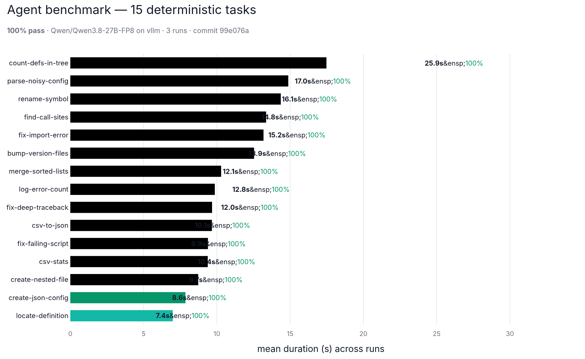
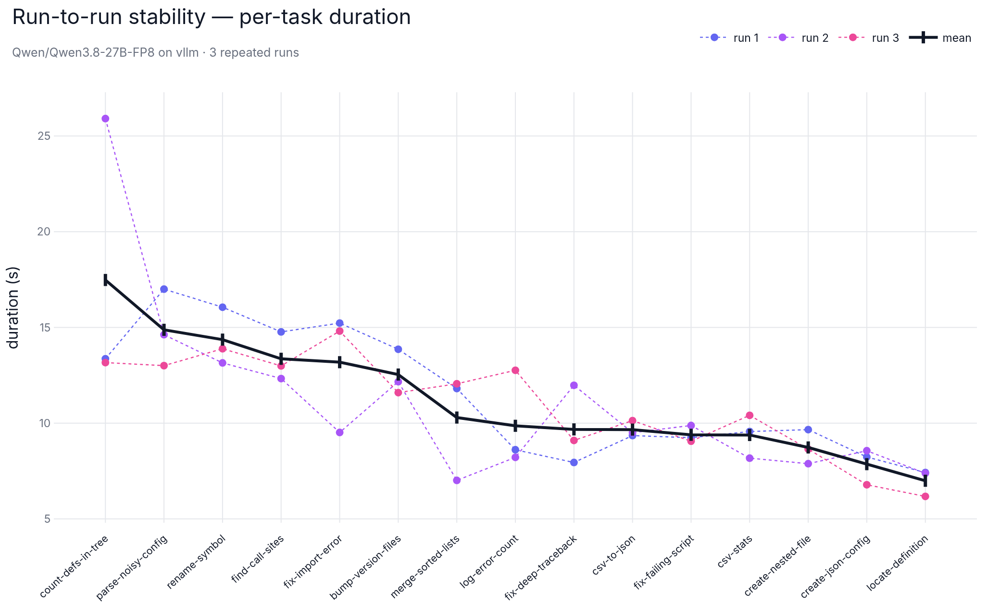

# Phoson CLI Benchmark

Lightweight agent-harness benchmark for `phoson-cli` one-shot mode,
inspired by Terminal-Bench: each task runs the CLI inside an isolated
temporary workspace, then a deterministic checker verifies the outcome.

This is also the **agent no-regression gate** (issue #139 / H-1): the
nightly workflow runs the set ≥3 times against a fixed local model,
measures the run-to-run noise, and fails when the pass rate drops below
the committed baseline minus that noise.

## Usage

```bash
uv run python bench/run_bench.py                 # run all tasks
uv run python bench/run_bench.py --filter git    # tasks matching substring
uv run python bench/run_bench.py --model openai/gpt-4o-mini
uv run python bench/run_bench.py --repeat 3      # stability runs
uv run python bench/run_bench.py --gate          # evaluate vs baseline.json
uv run python bench/run_bench.py --gate --bootstrap   # (re)seed the baseline
uv run python bench/run_bench.py --no-heldout    # train split only
```

Results are printed as a table and written to
`bench/results/bench-<timestamp>.json`.

## Task format

Each task is a Python file in `bench/tasks/` exposing:

```python
NAME = "task-name"
INSTRUCTION = "what the agent must do"

def setup(workspace: Path) -> None:
    """Optional: seed the workspace before the run."""

def check(workspace: Path, stdout: str, exit_code: int) -> tuple[bool, str]:
    """Return (passed, detail). Must be deterministic."""

def SOLVE(workspace: Path) -> None:
    """Reference solution (conformance oracle). Never seen by the agent."""
```

`SOLVE` is the model-free conformance oracle: the CI harness-quality test
asserts that `setup → SOLVE → check` passes for every task, so an
over-strict or broken checker is caught in CI instead of silently counting
against the model's nightly score. The agent never sees it — it runs in a
fresh temp workspace that only receives `setup`'s output.

## The no-regression gate (issue #139)

`run_gate()` in `run_bench.py` is pure and model-free; the logic it wraps
lives in `baseline.py` and is fully unit-tested (`tests/test_bench_baseline_gate.py`):

- **Bootstrap** — the committed `baseline.json` is a `pass_rate: null`
  sentinel, so the first real gated run self-seeds it (measured pass rate,
  noise, model, provider, commit, date). The nightly workflow commits that
  baseline back to `main`. A maintainer can re-seed deliberately with
  `--gate --bootstrap`.
- **Gate** — pass iff the current pass rate is *strictly* above
  `baseline − noise` (ties are rejected). `noise` is the population std of
  the current run's per-run pass rates (self-calibrating: a stable harness
  → tight floor, a flaky one → its own wider floor). The baseline may carry
  its own recorded noise and the larger of the two is used.
- **Per-task deltas** — `task_deltas()` reports per-task pass-rate movement
  vs the baseline, which is the falsifiable contract a harness PR declares
  (which tasks it predicts it fixes / puts at risk).
- **Held-out split** — `heldout.txt` names the subset a harness PR must
  *never* iterate against (`--no-heldout` runs the train split only). The
  gate reports the held-out pass rate on its own line, separately, so it can
  be watched for overfitting without affecting the verdict.

## Metrics captured

Per run: passed, duration, CLI exit code, stdout size. Cost/token metrics
require a `--json` output flag in one-shot mode (see ROADMAP suggestion):
one-shot currently prints only the final content and discards
`RunResult.steps` usage data.

## Reference results

Committed baseline (`bench/baseline.json`): **Qwen/Qwen3.8-27B-FP8** on
local vLLM, 3 runs × 15 tasks = 45 results, **pass rate 1.000, noise
0.000**, commit `99e076a`, 2026-09-11:

| Metric | Value |
|---|---|
| Pass rate | 45/45 (100%) across 3 runs |
| Noise (std of per-run pass rates) | 0.000 |
| Mean full-run wall time | 167.6s (~11.2s per task) |
| Fastest / slowest task (mean) | 7.0s (`locate-definition`) / 17.5s (`count-defs-in-tree`) |





| Task | Pass (3 runs) | Mean time | Range |
|---|---|---|---|
| bump-version-files | 3/3 | 12.5s | 11.6–13.9s |
| count-defs-in-tree | 3/3 | 17.5s | 13.2–25.9s |
| create-json-config | 3/3 | 7.9s | 6.8–8.6s |
| create-nested-file | 3/3 | 8.7s | 7.9–9.7s |
| csv-stats | 3/3 | 9.4s | 8.2–10.4s |
| csv-to-json | 3/3 | 9.7s | 9.3–10.1s |
| find-call-sites | 3/3 | 13.4s | 12.3–14.8s |
| fix-deep-traceback | 3/3 | 9.7s | 7.9–12.0s |
| fix-failing-script | 3/3 | 9.4s | 9.1–9.9s |
| fix-import-error | 3/3 | 13.2s | 9.5–15.2s |
| locate-definition | 3/3 | 7.0s | 6.2–7.4s |
| log-error-count | 3/3 | 9.9s | 8.2–12.8s |
| merge-sorted-lists | 3/3 | 10.3s | 7.0–12.1s |
| parse-noisy-config | 3/3 | 14.9s | 13.0–17.0s |
| rename-symbol | 3/3 | 14.4s | 13.1–16.1s |

Reproduce:

```bash
uv run python bench/run_bench.py --model "Qwen/Qwen3.8-27B-FP8" --provider vllm --repeat 3
```

Plots are generated from the results JSON with
[`bench/make_plots.py`](make_plots.py) (Plotly, a dev dependency):
PNGs for the README plus **interactive HTML exports** to embed on the
Phoson website (`bench/assets/*.html`):

```bash
uv run python bench/make_plots.py bench/results/bench-20260911-004146.json
```

## Notes

- Tasks run with the provider/model configured in `~/.phoson/config.toml`,
  unless `--provider`/`--model` pin them. The pin is applied by setting the
  `PHOSON_MODEL` / `PHOSON_PROVIDER` env vars on the one-shot subprocess
  (the CLI resolves these env → config.toml → default). Any value inherited
  from your own shell is dropped first, so a dev `PHOSON_MODEL` can't quietly
  re-target a baseline run (issue #138). The resolved target is printed up
  front (`Target: <model> @ <provider> (config.toml|--model/--provider)`)
  and recorded in the results JSON, so every saved run states exactly what
  it ran against — even when nothing was pinned (issue #139).
- The agent's `bash` tool inherits the benchmark process cwd, so all
  tasks execute inside the temp workspace.
- Each `bench/results/*.json` records the effective `model`, `provider` and
  the git `commit` it ran under, so a saved baseline is auditable.

## Nightly workflow

`.github/workflows/nightly-agent-eval.yml` runs on a schedule (and on
manual dispatch) and:

1. installs Ollama + pulls a **fixed local model** (default
   `qwen2.5:1.5b`; override via the `BENCH_MODEL` / `BENCH_PROVIDER`
   repo vars or the dispatch inputs — pass the bare model tag, the
   workflow strips any leading `ollama/` prefix),
2. runs the bench `--repeat 3 --gate`,
3. publishes the results as an artifact,
4. commits the self-seeded baseline back to `main` (only on the first real
   run, when the sentinel is replaced with data), and
5. fails the run if the gate reports a regression.

The baseline is tied to a specific local model + commit; re-seed it
(`--gate --bootstrap`) whenever you change the model or the eval set.
